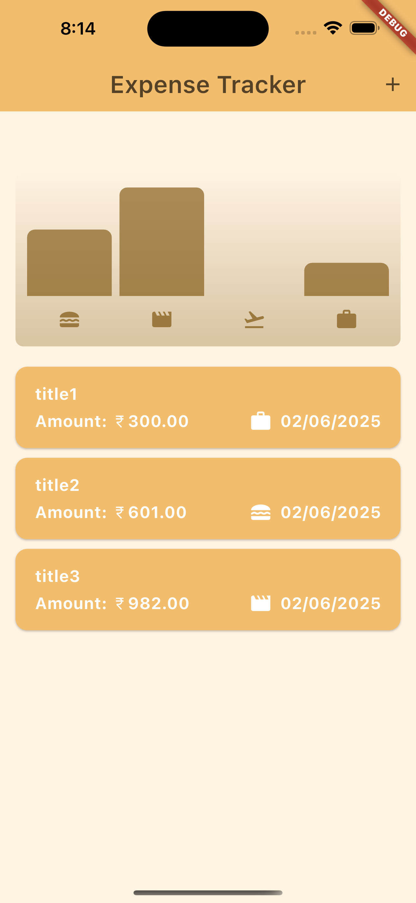
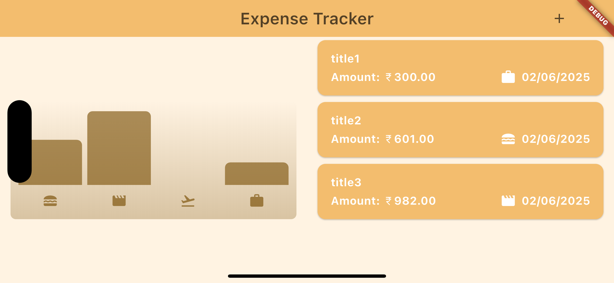
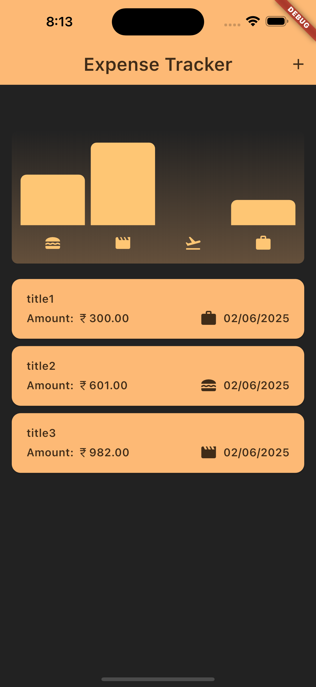
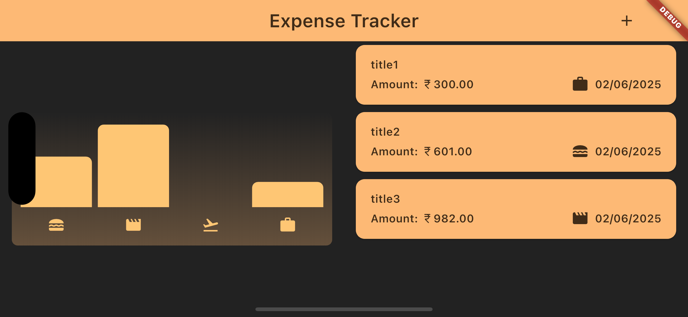

# 💸 Expense Tracker Pro

<div align="center">


**A sleek, intuitive expense tracking app built with Flutter**

*Monitor your spending • Visualize your expenses • Stay in control*

[📱 Demo](#-demo) • [✨ Features](#-features) • [🚀 Quick Start](#-quick-start) • [📖 Documentation](#-documentation)

</div>

---

## 🎯 Overview

Transform the way you manage your finances with **Expense Tracker Pro** — a beautifully crafted Flutter application that makes expense tracking effortless and insightful. Whether you're monitoring daily coffee runs or planning your next vacation, this app provides the tools you need to stay financially aware.

### 🌟 What Makes It Special?

- **🎨 Beautiful UI/UX** — Clean, modern design that adapts to your preferences
- **📊 Smart Analytics** — Instantly understand your spending patterns
- **🌓 Adaptive Theming** — Seamlessly switches between light and dark modes
- **📱 Responsive Design** — Perfect experience on any device orientation
- **⚡ Lightning Fast** — Smooth animations and instant responses

---

## ✨ Features

### 📊 **Visual Analytics**
- Interactive bar charts showing expense distribution
- Category-wise spending breakdown
- Real-time expense summaries
- Monthly/weekly spending trends

### 🎨 **Dynamic Theming**
- **Light Mode** — Clean, minimalist interface for daytime use
- **Dark Mode** — Easy on the eyes for evening sessions
- **System Sync** — Automatically adapts to device theme preferences

### 📱 **Responsive Experience**
- **Portrait Mode** — Optimized for one-handed usage
- **Landscape Mode** — Enhanced chart visibility and navigation
- **Cross-Platform** — Consistent experience on Android and iOS

### 🏷️ **Smart Categories**
- 🍕 **Food & Dining** — Track meals, groceries, and dining out
- ✈️ **Travel** — Monitor transportation and trip expenses  
- 🎮 **Leisure** — Entertainment, hobbies, and fun activities
- 💼 **Work** — Business expenses and professional tools

---

## 📱 Demo

<div align="center">

### Light Theme Experience
| Portrait | Landscape |
|:--------:|:---------:|
|  |  |

### Dark Theme Experience  
| Portrait | Landscape |
|:--------:|:---------:|
|  |  |

</div>

---

## 🏗️ Architecture

### 📂 Project Structure
```
expense_tracker/
├── 📱 lib/
│   ├── 🚀 main.dart                    # Application entry point
│   ├── 📊 models/                      # Data models & business logic              
│   │   └── expense.dart                # Expense data model
│   ├── 🎨 widgets/                     # Reusable UI components
│   │   ├── charts/                     # Chart-related widgets
│   │   │   ├── chart.dart              # Main chart component
│   │   │   └── chart_bar.dart          # Individual bar widget
│   │   ├── expenses/                   # Expense management widgets
│   │   │   ├── expense_list.dart       # Expense list view
│   │   │   ├── expense_item.dart       # Single expense item
│   │   ├── new_expense.dart            # Add new expense form
│   │   ├── expense_app.dart
│   │   └── ui/                         # Common UI elements
│   ├── 🎭 themes/                      # Theme configurations
│   └── 🔧 utils/                       # Helper functions & constants
├── 🖼️ assets/                          # Images, fonts, and resources
├── 🧪 test/                            # Unit and widget tests
└── 📋 docs/                            # Additional documentation
```

### 🔧 Key Components

- **📊 ExpenseChart** — Interactive bar chart visualization
- **📝 ExpenseList** — Scrollable list of expense entries  
- **➕ NewExpense** — Modal form for adding expenses
- **🎨 ThemeProvider** — Dynamic theme management

---

## 🚀 Quick Start

### 📋 Prerequisites

Before you begin, ensure you have:

- **Flutter SDK** (≥ 3.0.0) — [Installation Guide](https://docs.flutter.dev/get-started/install)
- **IDE**: Android Studio, VS Code, or IntelliJ IDEA
- **Device**: Android Emulator, iOS Simulator, or Physical Device
- **Git** — For cloning the repository

### ⚡ Installation

```bash
# 1. Clone the repository
git clone https://github.com/priyanshjain117/expense_tracker_app.git
cd expense_tracker_app

# 2. Install dependencies
flutter pub get

# 3. Run the app
flutter run
```

### 🔧 Development Setup

```bash
# Check Flutter installation
flutter doctor

# Run in debug mode
flutter run --debug

# Run in release mode  
flutter run --release

# Run tests
flutter test

# Build APK
flutter build apk

# Build iOS (requires macOS)
flutter build ios
```

---

## 🛠️ Tech Stack

<div align="center">

| Technology | Purpose | Version |
|:----------:|:-------:|:-------:|
|  | **UI Framework** | `≥ 3.0.0` |
|  | **Programming Language** | `≥ 2.18.0` |
| **Charts** | **Data Visualization** | `Custom Implementation` |

</div>

### 📦 Dependencies

```yaml
dependencies:
  flutter:
    sdk: flutter
  cupertino_icons: ^1.0.8
  intl: ^0.20.2
  uuid: ^4.5.1
  sensors_plus: ^6.1.1
  
dev_dependencies:
  flutter_test:
    sdk: flutter
  flutter_lints: ^5.0.0      # Code analysis
```

---

## 📖 Documentation

### 🎨 Customization

#### Adding New Categories
```dart
enum Category {
  food,
  travel,
  leisure,
  work,
}
```

### 🧪 Testing

```bash
# Run all tests
flutter test

# Run with coverage
flutter test --coverage

# Run specific test file
flutter test test/widget_test.dart
```

---

## 🤝 Contributing

We welcome contributions from the community! Here's how you can help:

### 🐛 Reporting Issues
- Use the [Issues](https://github.com/yourusername/expense-tracker-pro/issues) tab
- Provide detailed descriptions and steps to reproduce
- Include screenshots if applicable

### 💡 Suggesting Features
- Open a [Feature Request](https://github.com/yourusername/expense-tracker-pro/issues/new?template=feature_request.md)
- Explain the use case and potential implementation

### 🔧 Code Contributions
1. **Fork** the repository
2. **Create** a feature branch (`git checkout -b feature/amazing-feature`)
3. **Commit** your changes (`git commit -m 'Add amazing feature'`)
4. **Push** to the branch (`git push origin feature/amazing-feature`)
5. **Open** a Pull Request

### 📋 Development Guidelines
- Follow [Dart Style Guide](https://dart.dev/guides/language/effective-dart/style)
- Write tests for new features
- Update documentation as needed
- Keep commits atomic and well-described

---

## 📄 License

This project is licensed under the **MIT License** — see the [LICENSE](LICENSE) file for details.

```
MIT License - Feel free to use, modify, and distribute
Copyright (c) 2024 Your Name
```

---

## 🙏 Acknowledgments

- **Flutter Team** — For the amazing framework
- **Material Design** — For design inspiration  
- **Community Contributors** — For feedback and improvements
- **Open Source Libraries** — For making development easier

---

## 🌟 Show Your Support

If this project helped you or you found it interesting:

- ⭐ **Star this repository**
- 🍴 **Fork it for your own experiments**  
- 📢 **Share it with friends**
- 🐛 **Report issues** to help improve it
- 💡 **Suggest features** for future updates

---

## 📬 Connect & Support

<div align="center">

| Platform | Link | Purpose |
|:--------:|:----:|:-------:|
| 📧 **Email** | [jainpriyanshu117@gmail.com](mailto:jainpriyanshu117@gmail.com) | Direct contact |
| 💼 **LinkedIn** | [My Professional Profile](https://www.linkedin.com/in/priyanshu-jain-995b08322/) | Professional networking |
| 🐙 **GitHub** | [@priyanshjain117](https://github.com/priyanshjain117) | More projects |

**Made with ❤️ using Flutter**

</div>

---

<div align="center">

*"Good financial habits start with good tracking tools"*

**Happy Expense Tracking! 💸✨**

</div>